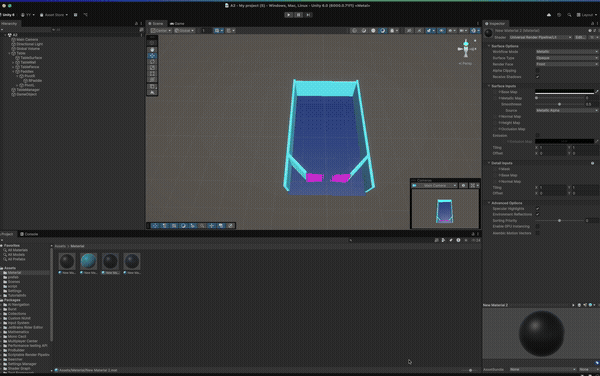

# Unity Pinball — Custom Physics Engine

   

A fully custom 2D pinball physics engine built inside Unity — **without using Unity's physics engine**. All collision detection, impulse resolution, energy transfer, and paddle dynamics are implemented from scratch in C#.

> Built as part of McGill COMP 521 (Modern Computer Games) to explore rigid-body collision geometry, impulse-based resolution, and procedural level generation.

---

## Demo



---

## Technical Highlights

### Custom Physics Loop
All ball movement runs through a hand-written `StepBalls()` integration loop — no `Rigidbody`, no physics materials. Each frame:
1. Constant gravity acceleration applied (`-20 units/s²` along the table axis)
2. Speed capped at `100 units/s` to prevent tunnelling
3. Collision detection and resolution against every obstacle type
4. Ball-ball pairwise impulse resolution

### Collision Detection & Resolution

| Surface | Method | Energy |
|---|---|---|
| Side walls | Axis-aligned normal reflection | ×0.9 |
| Top boundary | Axis-aligned normal reflection | ×0.9 |
| Inclined walls | Circle–segment closest-point projection + normal reflection | ×0.9 |
| Cylinder | Circle–circle overlap, radial normal | ×1.3 (energy gain) |
| Triangle | Circle–point proximity with offset hitbox | ×0.7 (energy loss) |
| Paddle | Circle–segment + **relative velocity** reflection with angular boost | variable |
| Ball–ball | Pairwise impulse, equal-mass symmetric resolution | ×0.9 |

### Moving Paddle Physics
Paddle collision uses **relative velocity** — the ball's velocity is transformed into the paddle's local frame, reflected, then transformed back to world space. The angular velocity of the paddle (`ω × r`) is used to compute the contact point's linear velocity, giving a realistic launch boost when the paddle is actively swinging.

```
v_relative = v_ball - v_paddle_at_contact
v_reflected = v_relative - (1 + e) * dot(v_relative, n) * n
v_out = v_reflected + v_paddle * boost
```

### Procedural Obstacle Generation
Cylinders and triangles are placed via a **rejection-sampling** loop that validates each candidate position against:
- Table boundary margins
- All previously placed obstacles (with configurable padding)
- Ball radius clearance to guarantee the ball can always pass between objects

Triangles are also given a random Y-rotation (45°–335°) to avoid grid-aligned edges that would create degenerate bounces.

### Ball Spawning with Overlap Detection
`TrySpawnBallRandom()` uses the same rejection-sampling strategy at runtime — checking boundaries, existing balls, cylinders, and triangles before placing a new ball, with a 100-attempt safety limit.

---

## Controls

| Action | Input |
|---|---|
| Launch ball | `Space` |
| Left paddle | `A` |
| Right paddle | `D` (or configured key) |
| Jiggle table | `Z` (hold) |

---

## Systems Overview

| System | Script | Key Idea |
|---|---|---|
| Physics loop & collision | `TableManager` | Custom Euler integration, all collision geometry |
| Paddle rotation & velocity | `PaddleController` | `Mathf.MoveTowards` + `ω × r` point velocity |
| Table jiggle | `TableManager.JiggleBalls()` | Random impulse applied to all live balls |
| Procedural placement | `TableManager.placeCylinders/Triangles()` | Rejection sampling with spatial clearance |
| Ball-ball collision | `ResolveBallBallCollisions()` | Symmetric impulse, equal mass |

---

## Stack

- **Engine:** Unity 2022.3 LTS
- **Rendering:** Universal Render Pipeline (URP)
- **Physics:** Fully custom (no Unity Rigidbody)
- **Language:** C#
